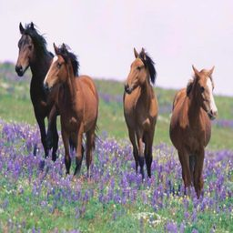
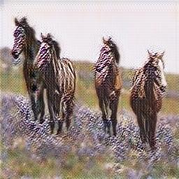
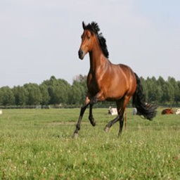
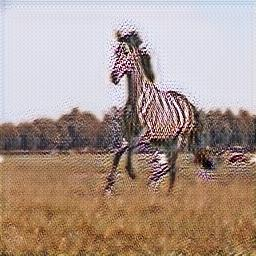
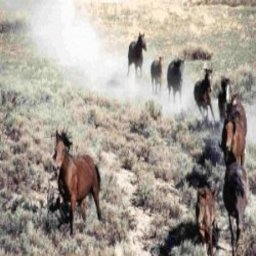
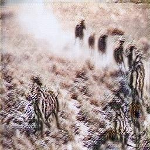

# CycleGAN: Unpaired Image-to-Image Translation 🦓🐴

implementation of [CycleGAN](https://arxiv.org/abs/1703.10593) for unpaired image-to-image translation. The included dataset is the classic horse2zebra dataset.

## Architecture

CycleGAN consists of:
- **2 Generators**: G_AB (A to B) and G_BA (B to A)
- **2 Discriminators**: D_A (judges domain A) and D_B (judges domain B)

## Quick Start

1. **Set up Python environment:**
   ```bash
   python -m venv venv
   source venv/bin/activate  # On Windows: venv\Scripts\activate
   ```

2. **Install dependencies:**
   ```bash
   pip install -r requirements.txt
   ```

3. **Train the model** (requires GPU for reasonable training time):
   ```bash
   python scripts/train.py
   ```
   - Checkpoints saved every epoch in `checkpoints/`
   - Training for 200 epochs (takes several hours on GPU)

4. **Generate translations:**
   ```bash
   python scripts/test.py
   ```
   - Translated images saved in `outputs/`
   - Uses the final model checkpoint by default

## Example Results

Here are some side-by-side comparisons of the translations from horses (domain A) to zebras (domain B) using the epoch 10 checkpoint (cherry-picked):

### Example 1: n02381460_800.jpg
| Original (Horse) | Translated (Zebra) |
|:---:|:---:|
|  |  |

### Example 2: n02381460_1300.jpg
| Original (Horse) | Translated (Zebra) |
|:---:|:---:|
|  |  |

### Example 3: n02381460_470.jpg
| Original (Horse) | Translated (Zebra) |
|:---:|:---:|
|  |  |

## Notes

CycleGAN uses three types of losses:
- adversarial loss
   - makes generated images look realistic
   - discriminator can't tell real from fake
- cycle consistency loss
   - A → B → A ≈ A (most important)
   - preserves content while changing style

identity loss 
   - G_AB(B) ≈ B (optional but helpful)
   - prevents unnecessary color changes

training process
1. generator creates fake images
2. discriminator learns to identify fakes
3. generator improves to fool discriminator
4. cycle consistency ensures meaningful translations
5. iterate until convergence


patchGAN discriminator
- classifies 70×70 patches instead of whole images
- more efficient and effective for textures

instance normalization
- better than batch normalization for style transfer
- normalizes each image independently

replay buffer
- stores past generated images
- prevents discriminator from overfitting

generator architecture
- ResNet-based with skip connections
- encoder-decoder structure
- 9 residual blocks by default

discriminator architecture  
- PatchGAN: classifies overlapping patches
- produces a grid of real/fake predictions
- more parameter-efficient than full image

training details
- Adam optimizer (lr=0.0002, β1=0.5)
- linear learning rate decay after 100 epochs
- batch size of 1 for stability


## References

- [Original CycleGAN Paper](https://arxiv.org/abs/1703.10593)
- [Project Page](https://junyanz.github.io/CycleGAN/)
- [Official Implementation](https://github.com/junyanz/pytorch-CycleGAN-and-pix2pix)

